# 🚀 BlinkItClone Admin App

This is an **Android-based Admin Application** built in **Kotlin**, designed to manage products and orders in an e-commerce-like system, inspired by BlinkIt. 
The app uses **Firebase Realtime Database** for data storage and **Firebase Cloud Messaging (FCM)** for push notifications.

---

## 🔧 Features

### 📦 Product Management
- Add new products with relevant details
- View all added products
- Edit/update existing product information
- Categorize products for easier filtering

### 📃 Order Management
- Display orders placed by customers
- View order status (Pending, Shipped, Delivered, etc.)
- Update the status of any order

### 🔔 Notifications
- Send automatic push notifications to customers when their order status is updated

---

## 🔗 Firebase Integration
- **Realtime Database**: Stores product details, orders, categories, and status
- **Firebase Cloud Messaging**: Sends notifications to customer devices
- **Firebase Authentication** *(optional)*: Can be added for admin login/logout functionality

---

## 📸 Screenshots

| 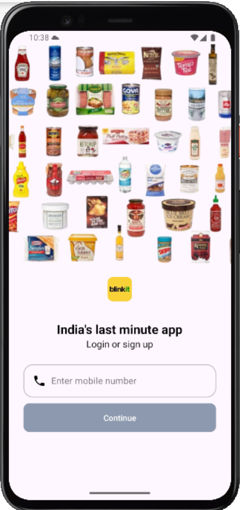                 | 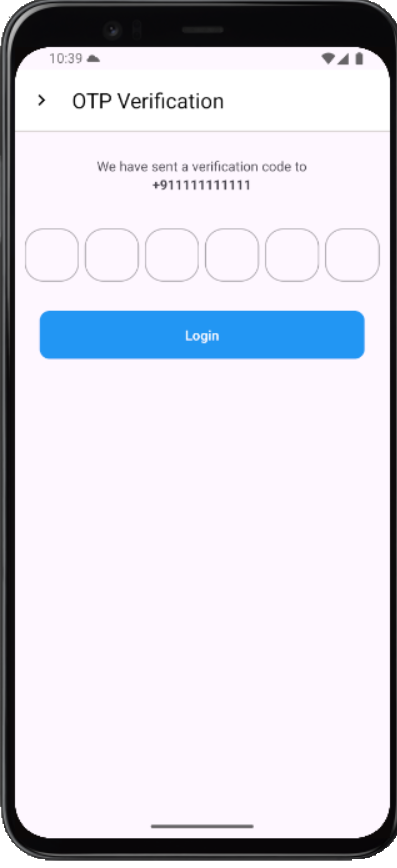 | 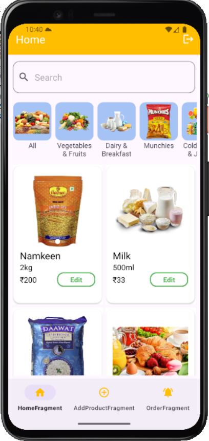 | 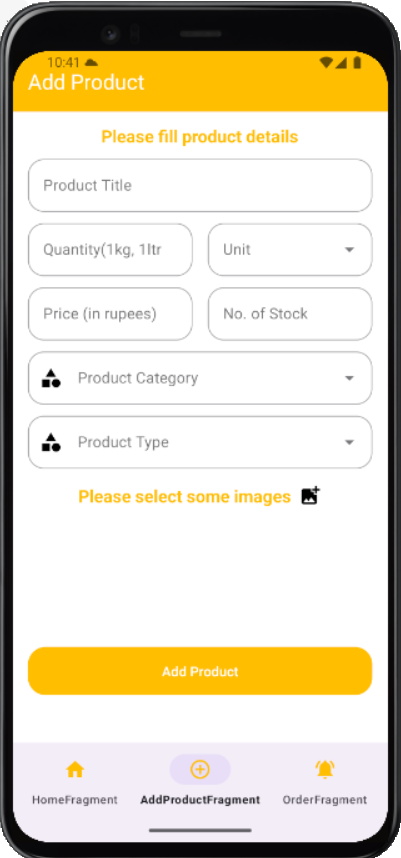 |
|---------------------------------------------------|---|---|---|
| 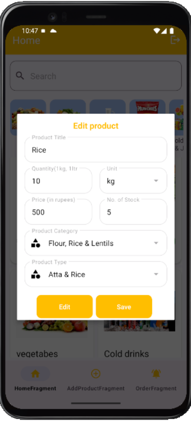 | 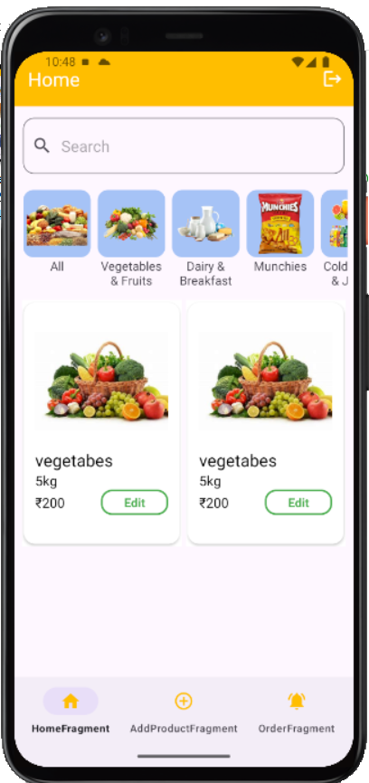 | 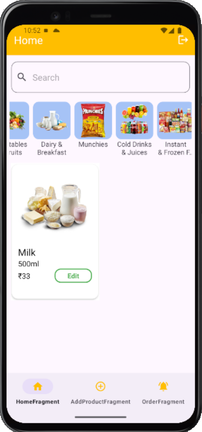 | 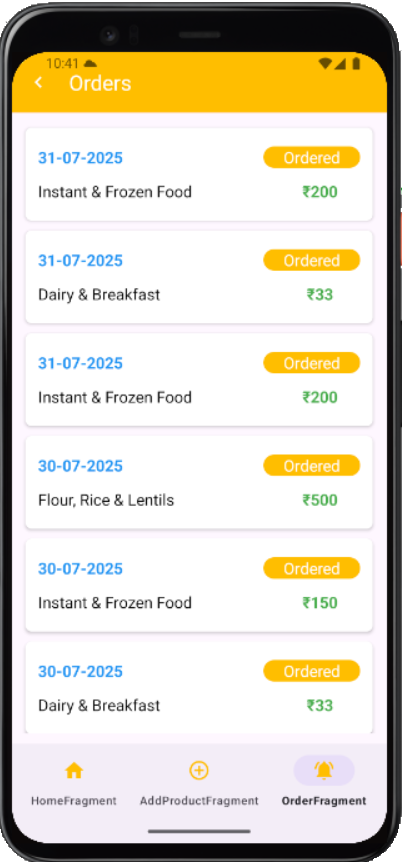 |
| 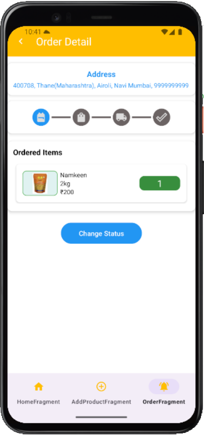     | 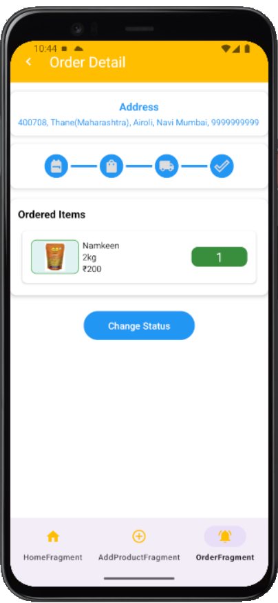 | 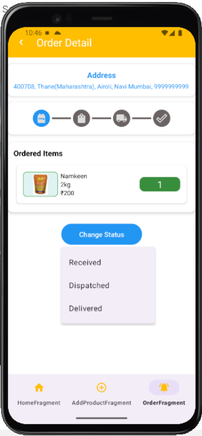 | &nbsp; |

Developed By
Prem Chand
Android Developer with expertise in building scalable admin and user-facing apps using Firebase and modern Android tools.

